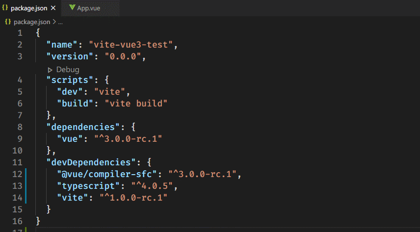
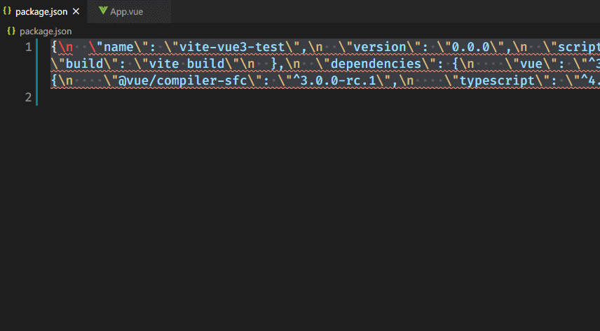
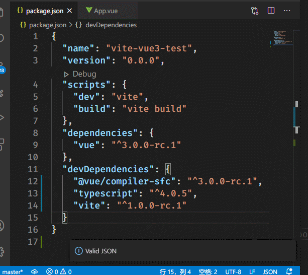
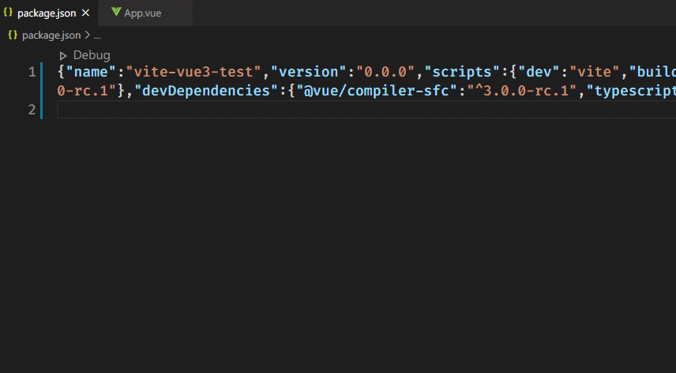

# Change Log

## 1.0.5

- Add `Escape JSON` command
- Add `Unescape JSON` command
- Add `Validate JSON` command

> Escape JSON

> Unescape JSON

> Validate JSON

## 1.0.4

- Add `Uglify JSON` command
- Add `Beautify JSON` command

> Uglify JSON

> Beautify JSON

## 1.0.0

- Initial release
- Add `Fix JSON` command

