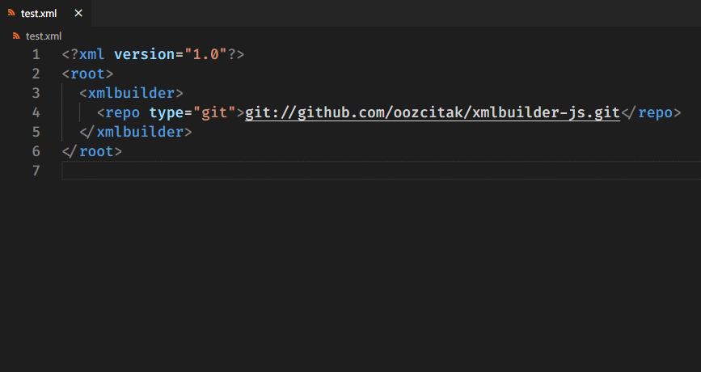

# Json Enhanced

[](https://marketplace.visualstudio.com/items?itemName=quanzaiyu.vscode-json-enhanced)


[](http://opensource.org/licenses/MIT)

<div align="center">

</div>

## Features

- Fix JSON
- Uglify JSON
- Beautify JSON
- Escape JSON
- Unescape JSON
- Validate JSON
- XML to JSON
- XML to JSON from clipboard
- JSON to YAML
- YAML to JSON

## Supported languages

- json

## Usage

### **Fix JSON**

1. Open a json file.
2. Write some wrong code.
3. Run the command named `Fix JSON` or use shortcut `Ctrl + Alt + F`.


> If cannot fix code, statusbar show wrong information


### **Uglify JSON**

1. Open a json file.
2. Run the command named `Uglify JSON`.


### **Beautify JSON**

1. Open a json file.
2. Run the command named `Beautify JSON`.


### **Escape JSON**

1. Open a json file.
2. Run the command named `Escape JSON`.


### **Unescape JSON**

1. Open a json file.
2. Run the command named `Unescape JSON`.


### **Validate JSON**

1. Open a json file.
2. Run the command named `Validate JSON`.


### **XML to JSON**

- `XML to JSON`
- `XML to JSON from clipboard`



### **JSON to YAML** / **YAML to JSON**

- `JSON to YAML`
- `YAML to JSON`


## Shortcuts

- Fix JSON: `Ctrl + Alt + F`

## Supported settings

### vscode-json-enhanced.indentationSpaces

```
Type: Number | Null
Default: null
Description: Number of spaces to use for indentation of formatted JSON output. If not set, your editor.tabSize setting is used.
```

## Based On

- [jsonic](https://github.com/rjrodger/jsonic)
- [YAML](https://github.com/eemeli/yaml)
- [node-xml2js](https://github.com/Leonidas-from-XIV/node-xml2js)

## References

- [json](https://marketplace.visualstudio.com/items?itemName=ZainChen.json)
- [Fix JSON](https://marketplace.visualstudio.com/items?itemName=oliversturm.fix-json)
- [vscode-json](https://marketplace.visualstudio.com/items?itemName=andyyaldoo.vscode-json)
- [XML to JSON](https://marketplace.visualstudio.com/items?itemName=quanzaiyu.vscode-json-enhanced)
- [YAML ❤️ JSON](https://marketplace.visualstudio.com/items?itemName=hilleer.yaml-plus-json)
