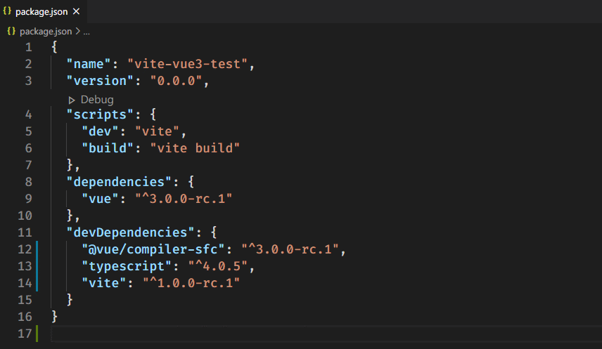
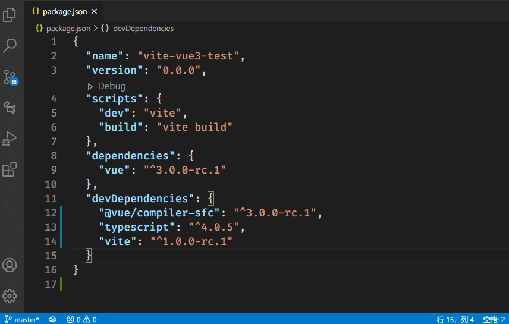

# vscode-json-enhanced README

[](http://opensource.org/licenses/MIT)

<div align="center">

</div>

## Features

- Fix JSON

## Supported languages

- json

## Usage

### **Fix JSON**

1. Open a json file.
2. Write some wrong code.
3. Run the command named `Fix JSON` or use shortcut `Ctrl + Alt + F`.



> If cannot fix code, statusbar show wrong information



## Shortcuts

- `Fix JSON`: `Ctrl + Alt + F`

## Supported settings

### vscode-json-enhanced.fixJSON.indentationSpaces

```
Type: Number | Null
Default: null
Description: Number of spaces to use for indentation of formatted JSON output. If not set, your editor.tabSize setting is used.
```

## Based On

- [jsonic](https://github.com/rjrodger/jsonic)


## References

- [json](https://marketplace.visualstudio.com/items?itemName=ZainChen.json)
- [Fix JSON](https://marketplace.visualstudio.com/items?itemName=oliversturm.fix-json)
- [vscode-json](https://marketplace.visualstudio.com/items?itemName=andyyaldoo.vscode-json)
- [XML to JSON](https://marketplace.visualstudio.com/items?itemName=buianhthang.xml2json)
- [YAML ❤️ JSON](https://marketplace.visualstudio.com/items?itemName=hilleer.yaml-plus-json)
